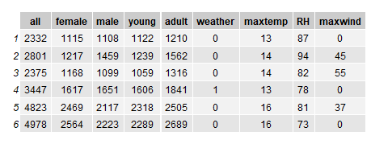
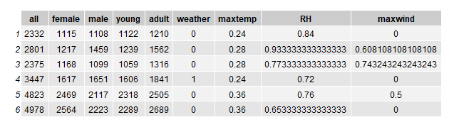
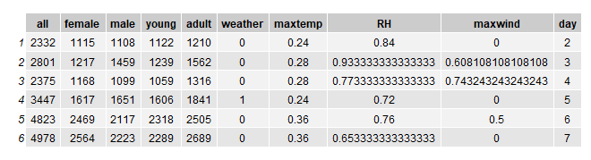

The team chose to run different scenarios with different settings to the initial data, in order to be able to make comparisons between them and understand which scenario gives better results.

## <b>List of scenarios:</b>
- [Scenario 1](#scenario1)
- [Scenario 2](#scenario2)
- [Scenario 3](#scenario3)
- [Scenario 4](#scenario4)

## <b>Scenario 1</b> 
In this first scenario we use the original dataset, without making any changes to the data. The only thing to point out is the removal of the day column that had been previously added in the Data Preparation phase.
 

## <b>Scenario 2</b> 
In the second scenario we chose to perform a normalization of the data (Min-Max normalization). As in scenario 1, we also performed the removal of the day column that had previously been added in the data preparation phase.
 

## <b>Scenario 3</b> 
For the third scenario we also performed normalization of the data (Min-Max normalization) and in this case we did not remove the day column that had previously been added in the data preparation phase.
 

## <b>Scenario 4</b> 
In the fourth and last scenario, we also presented the normalization of the data (Min-Max normalization), did not remove the day column that had previously been added in the data preparation phase, and performed the treatment of outliers, which were changed to the mean value.
 
